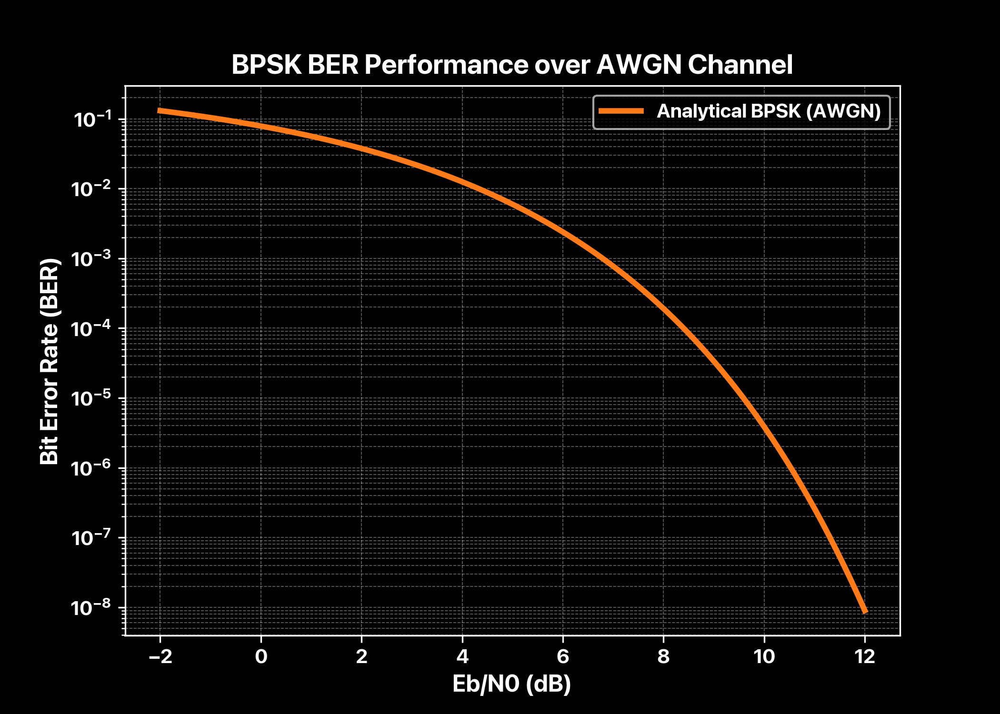

# Microwave Digital Communication System Analysis

## Overview

This project presents a system-level analysis of a microwave digital communication link, focusing on channel modeling, digital modulation behavior, and noise-limited performance. Instead of hardware implementation, the emphasis is on analytical modeling and simulation to validate theoretical communication principles under realistic assumptions.

## Objectives

- Understand microwave communication channel characteristics  
- Analyze digital modulation schemes  
- Explore the relationship between signal-to-noise ratio (SNR) and bit error rate (BER)  
- Validate simulation results against analytical theory  

## System Model

### Channel Model

The microwave communication channel is modeled considering path loss, fading, and noise effects to reflect realistic operating conditions.

### Modulation Scheme

Digital modulation techniques are employed to study their performance over the modeled channel in terms of error rates and robustness.

## SNR vs BER Analysis

The bit error rate (BER) for the system is analyzed as a function of the signal-to-noise ratio (SNR). The theoretical BER for the modulation scheme is given by:

`BER = Q(√(2 · Eb/N0))`

where **Q(·)** represents the tail probability of the standard normal distribution, commonly used to describe the probability of bit error due to noise.

  

## Results

- The simulation results closely match the analytical BER expressions, confirming the accuracy of the system model and assumptions.  
- The generated plots illustrate the expected decrease in BER with increasing SNR, demonstrating the noise-limited performance of the communication link.

## Tools Used

- Python (NumPy, Matplotlib) or MATLAB for simulation and plotting  
- Analytical BER expressions for theoretical validation  
- Monte Carlo simulation methods for performance evaluation  

## Repository Structure

- `analysis/` — theoretical modeling and explanations  
- `scripts/` — simulation code used to generate results  
- `plots/` — generated figures (SNR vs BER)  
- `report/` — consolidated PDF summary  

## Key Takeaways

- Analytical and simulation approaches complement each other in communication system design.  
- Understanding channel and modulation impacts is crucial for predicting system performance.  
- Visualization of BER vs SNR provides intuitive insight into system reliability under noise.